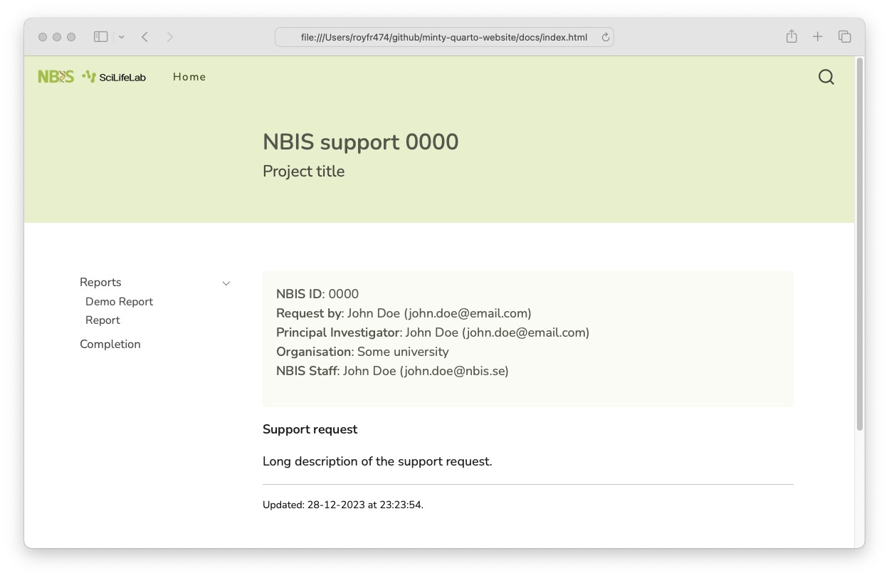
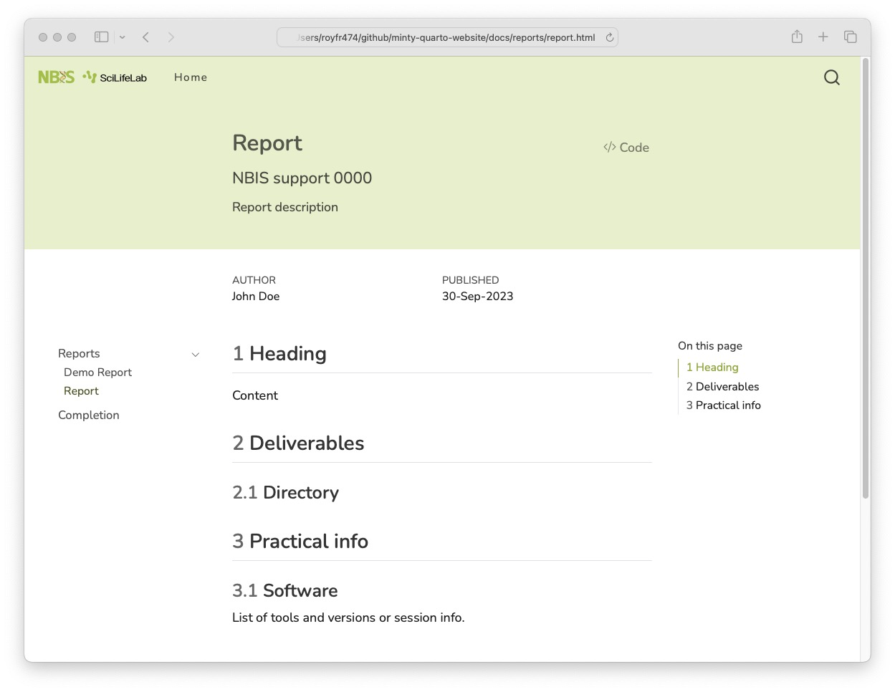

# folium <span><a href="https://github.com/royfrancis/folium"></a></span> 

[](https://github.com/royfrancis/folium/actions?workflow=deploy)    [](https://lifecycle.r-lib.org/articles/stages.html#experimental)

A quarto website template for project reports. For a single page template, see [folium-webpage](https://github.com/royfrancis/folium-webpage).





For a demo site, see [here](https://royfrancis.github.io/folium).

## Usage

- Required quarto 1.4.549 or higher
- To download a starter template, run in the terminal

:exclamation: Demo files are not downloaded

```
quarto use template royfrancis/folium
```

- Launch preview in the browser

```
quarto preview
```

Note that preview will attempt to build all documents.

- Render all html files into `docs` directory

```
quarto render
```

## Tips

- Template directory structure

```
.
├── assets
├── completion.qmd
├── _extensions
├── index.qmd
├── _quarto.yml
└── reports
    └── report.qmd

```

- Update `nbis` variables in **_quarto.yml**
- Add/modify reports in the `reports` directory as needed
- To selectively preview/render files:
  ```
  quarto preview reports/report.qmd
  quarto render reports/report.qmd
  ```
- To remove automatic list of files from the sidebar, remove `sidebar` from **_quarto.yml**.
  - You can optionally manually link reports in `index.qmd` like this:

  ```
  [Report](reports/report.qmd)
  ```
- If project is incomplete, set `completion.qmd` to not be rendered in **_quarto.yml**.

  ```
  render:
    - "*.qmd"
    - "!completion.qmd"
  ```

- Use `##` as the highest level heading. Do not use `#`.
- The site won't be indexed by search engines (probably) due to `<meta name="robots" content="noindex">` in head.

## Acknowledgements

- Built using [Quarto](https://quarto.org/)

---

2024 • Roy Francis
