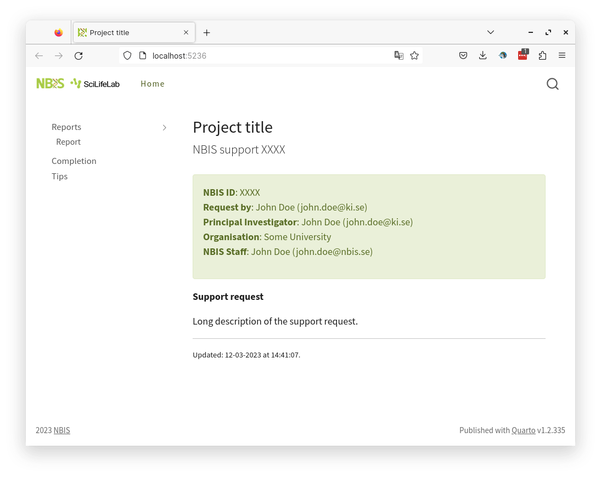
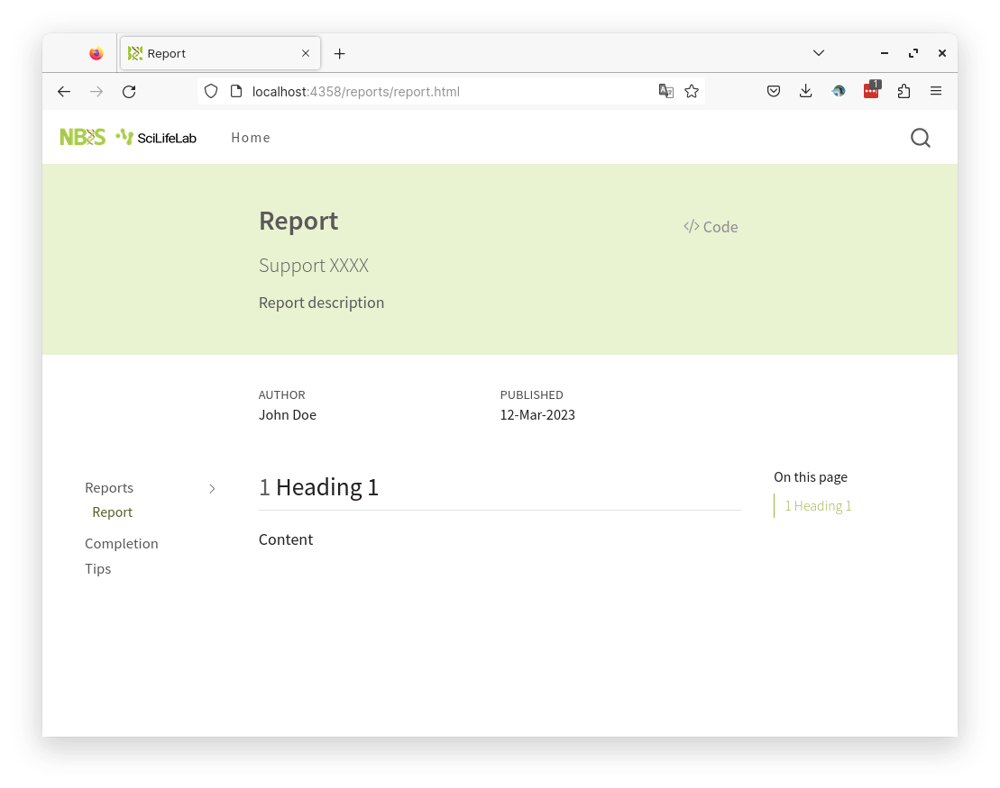

# minty-quarto-website

A quarto website template for project reports.





## Usage

- Required quarto 1.2.335 or higher
- Run

```
quarto use template royfrancis/minty-quarto-website
```

- Launch preview

```
quarto preview
```

## Tips

- To remove automatic list of files from the sidebar, remove `sidebar` from `_quarto.yml`.
  - You can optionally manually link reports in `index.qmd`.
- Include `completion.qmd` on completion of the project, else remove it.

---
2023 • Roy Francis